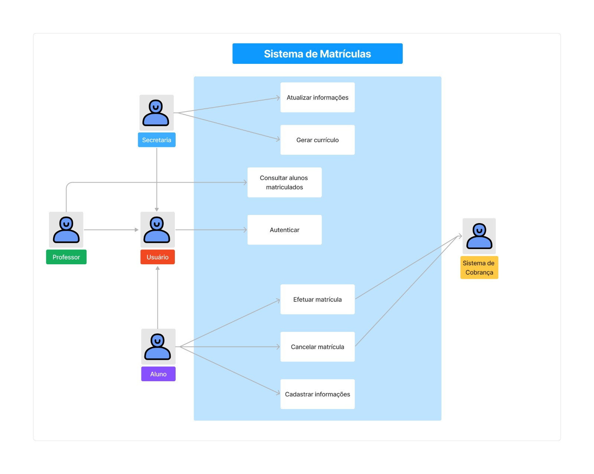
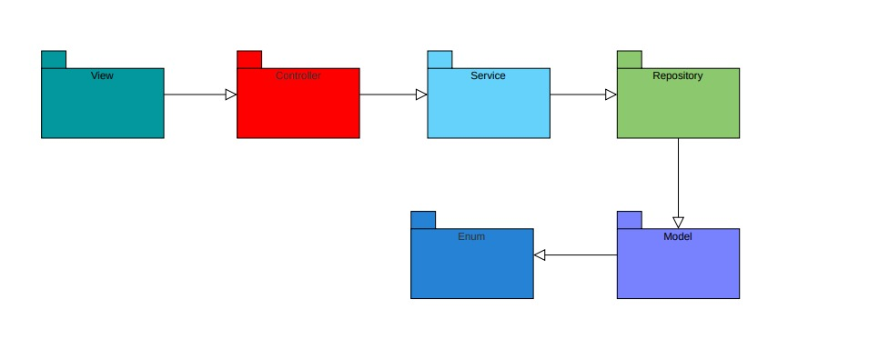

# Lab01-Projeto-de-Software

## 📜 Histórias de Usuários 
<ul>
  <li>Eu como usuário quero realizar login para acessar funcionalidades do sistema.</li>
  <li>Eu como aluno quero efetuar matrícula em disciplinas para cursá-las e continuar o
curso.</li>
  <li>Eu como aluno quero cancelar a matrícula para reorganizar minha carga horária.</li>
  <li>Eu como professor quero consultar a lista de alunos matriculados para me preparar
para as aulas</li>
  <li>Eu como secretária quero cadastrar informações de alunos, professores e disciplinas
para manter o sistema atualizado.</li>
  <li>Eu como secretária quero gerar currículo de disciplinas ofertadas para os alunos
saberem quais estão disponíveis.</li>
</ul>

## Diagrama de Casos de Uso

</img>

## Diagrama de Pacotes

</img>

## Diagrama de Classes

</img>

## Funcionamento do Sistema

</img>
